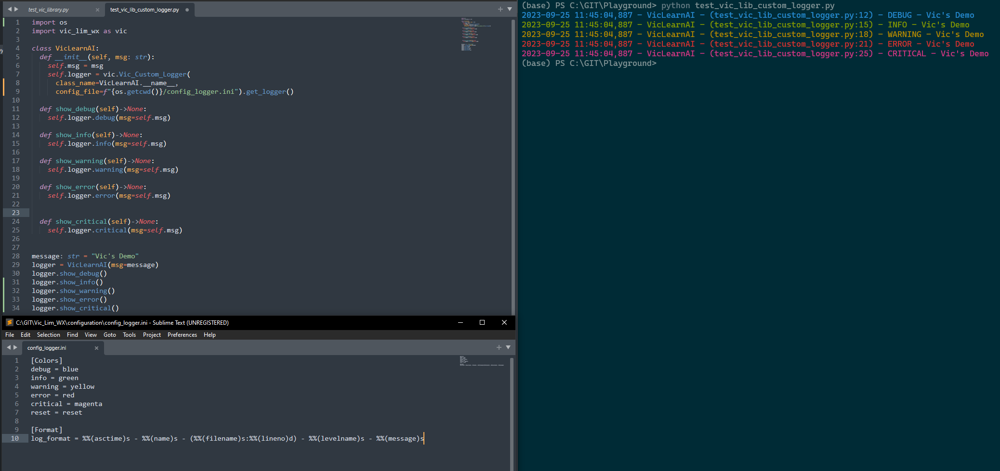

# <b><u>Custom Logger</u></b>

## <b><u>Potential Wish-list</u></b>
How nice will it be if you can have the following
- ways to customize your very log format ... 
- as well as defining the color for each log level ...

While it is definitely possible to code it, 
wouldn't it be nice if there is a package that is 
ready made, and it answers the above wish-list ?

This very package of mine has already been taken care of, so that you can now focus on developing
business codes and more !!!

## <b><u>Sample of what is to be expected</u></b>

<b><u>Description</u></b><br>
Well this is a sample of how it is made possible


From the above example, all that is to do is to ensure that the
`config.ini` file is present, and with the same format structure. 
Then you will be able to customize straight away !!!

## <b><u>How to use</u></b>
<b><u>Step 1</u></b><br>
Ensure the 2 sections inside the `config.ini` 
    file are present
* `[Colors]`
* `[Format`

<b><u>Step 2</u></b><br>
Ensure the following keys inside the `config.ini` 
    file are present

```ini
[Colors]
debug = 
info = 
warning = 
error = 
critical = 
reset = 

[Format]
log_format = 
```

<b><u>Step 3</u></b><br>
For each of the levels, you may wish to use the following available color name
* 'black',
* 'red',
* 'green',
* 'yellow',
* 'blue',
* 'magenta',
* 'cyan',
* 'white',
* 'reset' (This will basically set the log back to its original color)

<b><u>Step 4</u></b><br>
Call out the below function to initialize
* Provide the `class_name` or any other value you like.
* Provide the file directory for `config_file` argument
```python
import vic_lim_wx as vic

logger = vic.Vic_Custom_Logger(
    class_name="",
    config_file=""
)
```